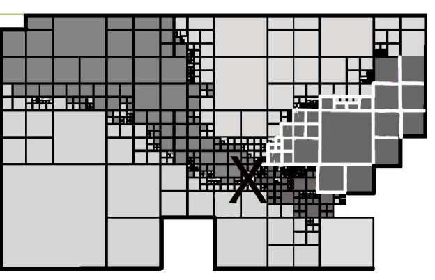
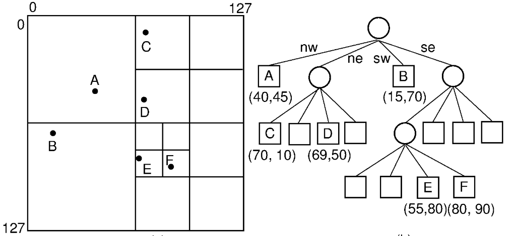

# Project Proposal

## Project Title: Exploiting SIMD in Quadtree Querying
Team Member: Rong Mu (rongmu), Ziruo Xiao (ziruox)

### SUMMARY
This project proposes to develop SIMD-parallel techniques for accelerating the querying of Point-Range quadtree. The primary goal is to enable batch processing of multiple nodes in a query simultaneously, by exploiting SIMD-friendly traversal logic and memory optimization techniques. We also hope to explore the parallelism across queries and compare the parallelism performance of different spatial indexing tree structures.

### Background
The quadtree is a widely used hierarchical data structure for managing spatial data1. It is commonly applied in spatial databases for spatial partitioning and query processing, and other scenarios like physics simulation. By recursively subdividing space into four quadrants, quadtrees provide a compact and locality-aware representation of spatial datasets. As spatial datasets continue to grow in both size and resolution, the need to accelerate spatial query processing has become increasingly critical. Operations such as range query searches and nearest neighbors search are fundamental to many applications, but high memory bandwidth and computation complexity are common bottlenecks.

     
    

Figure 1: left: an example of quadtree architecture; right: an example of quadtree built on the US map for geospatial database querying.

The hierarchical structure of quadtree allows query search to efficiently eliminate large irrelevant regions early, but its conventional implementations do not fully exploit the data-level and task-level parallelism in modern hardware, such as SIMD and multithreading, so accelerating the quadtree query processing is an important and interesting topic to explore.

In this project, we are going to focus on optimizing the range querying in the Point-Range quadtree (PR quadtree). The PR quadtree is a versatile spatial data structure capable of representing both point and region-based spatial data, making it well-suited for diverse applications. Range querying is a critical operation on PR quadtrees, retrieving all spatial objects intersecting a given region, which serve as a basis for various spatial querying. To the best of our knowledge, this is the first work for SIMD Quadtree query processing and optimization.

#### Potential Idea and Approach
Our primary implementation plans to involve within-query parallelism by leveraging SIMD vectorization. Specifically, during each query traversal, we will use SIMD to perform range checking of a batch of regions of subtrees in parallel. This process continues recursively, enabling efficient pruning of irrelevant regions at each level of the quadtree to accelerate the node filtering and search the query more efficiently. 

We will explore SIMD-friendly traversal logic, such as BFS-like and DFS-like approaches. DFS processing of PR quadtree nodes sequentially introduces branching and irregular memory access, hindering SIMD parallelization. Conversely, BFS enables batch processing of child nodes for SIMD but incurs queue management overhead. We will explore BFS-DFS hybrid and other searching approaches (e.g., Best-first search) to reduce overhead, using BFS with SIMD in the upper levels of the tree when batch parallelism is effective and using DFS in deeper levels where lightweight traversal is more efficient.

We will also explore SIMD-friendly memory tricks. First, we can optimize the tree storage structure by storing node bounding boxes and point coordinates using a Structure of Array layout to improve the cache locality and minimize the scatter/gather overhead. Second, we can apply a memory compression method to reduce memory bandwidth and load more points per SIMD register. Besides, we will plan to study prefetching techniques to explore the way to predict and prefetch bounding boxes and child nodes of next-level nodes to reduce cache misses.

With the above tasks smoothly done, we also hope to explore SIMD/multi-thread parallel (Vectorization) across query to achieve further acceleration.

### The Challenge
The nature of the PR quadtree provides space for SIMD utilization, but the inherent complexity and irregularity of the PR quadtree data structure can make it difficult to efficiently parallelize and optimize for SIMD processing. The main challenges include:

**Data Dependencies:** The traversal of the PR quadtree exhibits data dependencies, as the search path through the tree depends on the query point. This can lead to divergent execution, making it challenging to leverage SIMD parallelism effectively, as the constraint of systems in balancing parallelism and overhead.

**Memory Access Patterns:** The memory access patterns in the PR quadtree are irregular and lack spatial locality, as the nodes are distributed across memory based on the spatial partitioning of the tree. This can result in inefficient use of some SIMD operations and poor cache utilization, as constrained by the way a tree structure is stored. The way the nodes are organized in memory can significantly impact the performance of SIMD-friendly memory access techniques, such as prefetching and memory compression. Optimizing the tree storage structure for SIMD processing may require non-trivial modifications to the data structure.

**Communication to Computation Ratio:** Constrained by the heterogeneous nature of query points, the PR quadtree traversal involves a significant amount of pointer chasing and conditional branching, leading to a high communication to computation ratio. Irregular access patterns and varying levels of spatial coherence among the query points can further impact the effectiveness of SIMD parallelization.

### RESOURCES
Compute resource (details given in platform choice session): We need SIMD and system profiling supported computers and plan to first work on GHC machines, but may benefit from machines with wider SIMD/more cores/allows profiling tools installation.

**Starter code:** We are going to build upon this baseline implementation of Quadtree: https://github.com/pvigier/Quadtree

**Dataset:** The baseline implementation also contains a test data generator. Plus, we plan to test on real-world datasets. We haven’t figured out the existing spatial database with quadtree constructed, and we may try to construct one by ourselves from geospatial datasets.

**Related works:**

[SIMD-ified R-tree Query Processing and Optimization](
https://dl.acm.org/doi/pdf/10.1145/3589132.3625610)

[Parallel Quadtree Coding of Large-Scale Raster Geospatial Data on GPGPUs]
(https://dl.acm.org/doi/pdf/10.1145/2093973.2094047)

### GOALS AND DELIVERABLES

**Plan To Achieve**
- Implement SIMD parallel within query:
    - Batch-process multiple query points simultaneously using SIMD instructions.
    - Exploit SIMD-friendly traversal logic (e.g., search order benefiting gather/scatter, selective load/store)
- Exploit SIMD-friendly memory tricks:
    - Tree storage structure (how nodes are organized in the range of address)
    - Memory compression methods
    - Study possible prefetching techniques
- Compare performance with baseline on generated dataset, including speedup and system performance analyzation

Given the nature that PR quadtree has 4 child nodes per non-leaf node, we hope to achieve a speedup close to 4x, or otherwise understand the bottleneck for speedup.

**Hope To Achieve:**
- Conduct experiments on real-world dataset (likely need to construct first)
- SIMD/multi-thread parallel (Vectorization) across query
- A speedup and system profiling comparison with other tree structure SIMD (e.g., [R-tree](https://dl.acm.org/doi/pdf/10.1145/3589132.3625610)).

### PLATFORM CHOICE

#### Language

We are going to use C++ for implementation, as C++ is a common and efficient language for system development with SIMD.

#### Computation resource
We are going to start with implementing and conducting experiments on the GHC machine with SIMD support. The GHC machines have 8 cores and 8 SIMD ALUs per core. This supports AVX2 which provides 256-bit wide registers that can process, e.g., 4 double-precision numbers in parallel, and is capable of conducting basic system profiling.

We think this is adequate for our experiments for at least the Plan To Achieve goals. But we may need machines with wider SIMD/more cores/allows profiling tools installation. We may then switch to AWS machines.

### SCHEDULE

| Time                  | TODOs                                                                                                  |
|-----------------------|--------------------------------------------------------------------------------------------------------|
| Week 1 (3.26-4.1)   p.s. Midterm 2 on 4.2   | - Conduct a comprehensive literature review on related work (quadtree optimization, related SIMD techniques)   - Try out the starter code |
| Week 2 (4.2-4.8)     | - Build dataset from generation code   - Implement naive SIMD across-node parallelism, conduct basic experiments and profiling |
| Week 3 (4.9-4.15)   p.s. Milestone report on 4.15    | - Exploit different SIMD algorithms, with corresponding suitable traversal logic, conduct basic experiments and profiling   - Record milestone results in the report |
| Week 4 (4.16-4.22)   | - Exploit memory-related techniques, including storage order, tree compression/linearize, prefetching   - Conduct thorough experiments and profiling |
| Week 5 (4.23-4.29)   | - Depending on the progress, optionally try the hope to achieve tasks   - Wrap up the project, prepare final report and presentation |

### Reference
1. Samet, H. "The quadtree and related hierarchical data structures." ACM Computing Surveys (1984)
2. Gaede, V., & Günther, O. "Multidimensional access methods." ACM Computing Surveys (1998)
3. Kim, J., Kim, Y., & Kim, S. "SIMD-ified R-tree Query Processing and Optimization."   arXiv:2309.16913, 2023.

